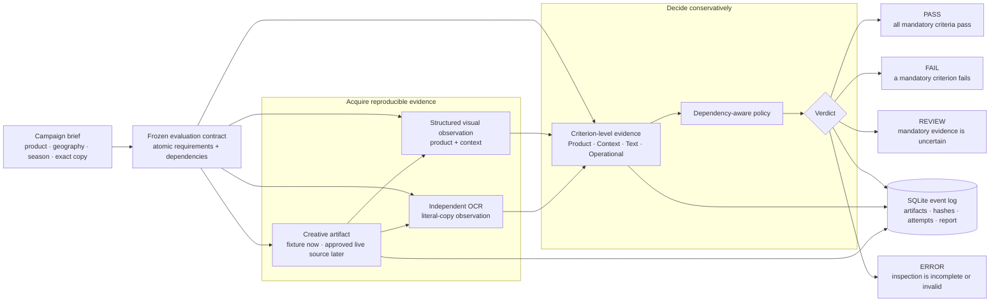
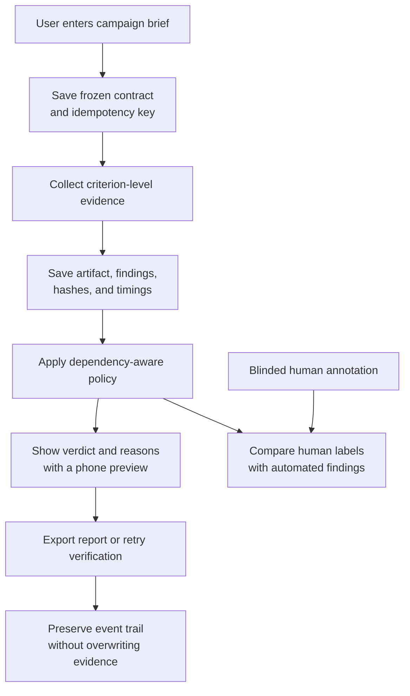
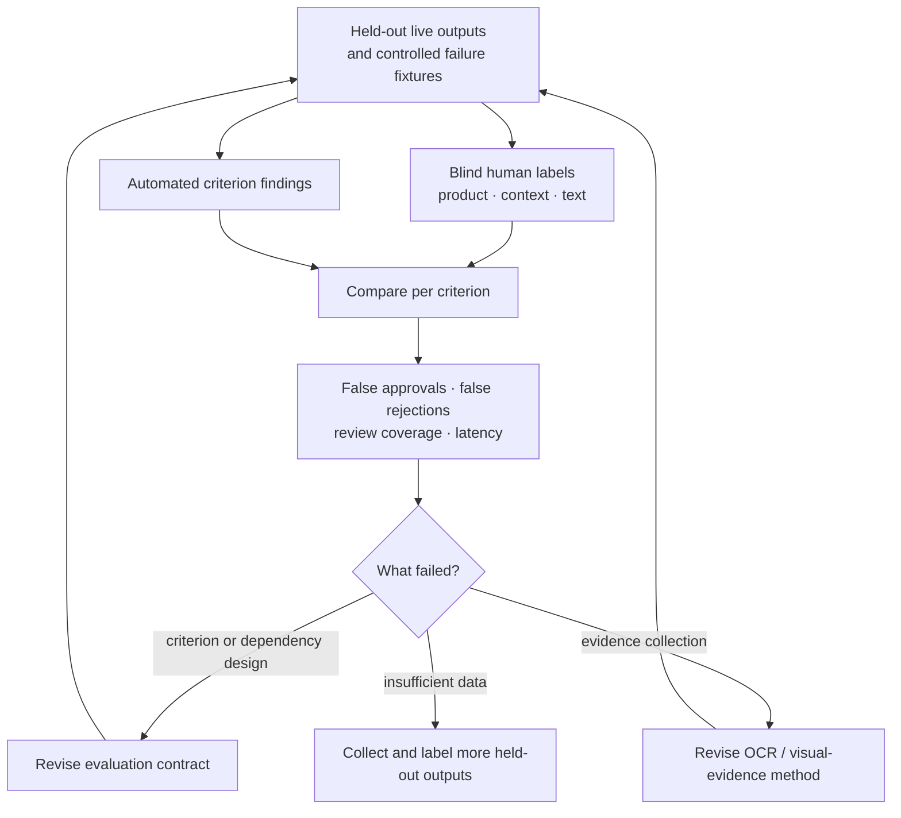

# ProofAd

**ProofAd is an evaluation system for display-ad creative.** It turns a campaign brief into an explicit, evidence-backed decision: does the creative show the intended product, fit the required context, render the literal offer, and complete all required checks?

The project is deliberately designed as a useful product: an inspectable evaluation policy, recoverable local run state, and an interface that makes important distinctions visible. It does **not** present an attractive image or a model explanation as proof that an ad is correct.

> Current status: **Phase A is fully local and fixture-backed.** The evaluation contract, evidence records, dependency policy, human-annotation surface, and behavioral cases are the work under test. Image/vision models are deliberately replaceable evidence sources; Gemini remains locked and optional Ollama can never change an official verdict.

## Start here

ProofAd is intentionally small in surface area and strict in behavior:

| If you need to… | Start here | What you get |
| --- | --- | --- |
| See the product in action | [http://localhost:3000/demo](http://localhost:3000/demo) | A guided failure case, a narrow preview, and a fresh local run. |
| Evaluate a brief in a browser | [http://localhost:3000/app](http://localhost:3000/app) | A frozen contract, visible findings, retry, export, and run history. |
| Label and measure results | [http://localhost:3000/evaluation](http://localhost:3000/evaluation) | Human annotation kept separate from automated findings. |
| Call it from software | [Pipeline and MCP](#use-the-evaluation-pipeline-without-a-browser) | JSON endpoints and MCP tools using the same persisted decision path. |

The central operating rule is simple: **make the requirement visible, make the evidence visible, and never hide uncertainty.**

## Contents

- [The problem and the response](#the-problem-and-the-response)
- [Quick start](#quick-start)
- [Use the evaluation pipeline without a browser](#use-the-evaluation-pipeline-without-a-browser)
- [Architecture](#architecture)
- [Inspection and verdict policy](#inspection-and-verdict-policy)
- [Test-run library](#test-run-library)
- [Research basis](#research-basis)
- [Trust boundaries](#trust-boundaries)

## The problem and the response

Generative creatives fail in ways that a single aesthetic score can hide: the offer can be wrong, a product can be substituted, or evidence can be incomplete. **ProofAd’s contribution is a decision system for catching, explaining, and measuring those failures.**

The central question is not *“Which model made the best image?”* It is:

> **“When can an evaluator safely approve a creative, when must it reject it, and when must it admit uncertainty?”**

That makes the model boundary intentionally boring and swappable. The judge-facing value is the frozen campaign contract, atomic criteria, dependency graph, independent evidence channels, deterministic gate, human calibration, and replayable audit trail.

### What we will measure

| Evaluation question | Measurement | Claim discipline |
| --- | --- | --- |
| Does the policy catch mandatory defects? | Controlled wrong-copy, wrong-product, wrong-context, missing-evidence, and oversized-artifact cases. | Fixtures prove application behavior, not model quality. |
| Does the automated evaluator agree with people? | Blinded per-criterion human labels on held-out live outputs; report false approvals, false rejections, and review coverage. | No accuracy claim until those labels and results exist. |
| Is a verdict explainable and reproducible? | Saved contract, evidence, hashes, events, criterion-level report, and retry path. | A report records evidence; it is not certification. |
| Does the workflow stay safe under failure? | Duplicate-submit, refresh/recovery, corrupt artifact, failed evidence-source, and incomplete-check tests. | Local recovery is not a claim of production HA. |

### Deliberate non-goals

- Selecting, training, or claiming superiority of an image-generation model.
- Treating an LLM/vision-model explanation as ground truth.
- Replacing human review for uncertain, high-stakes, or incomplete evidence.

## What a user can do today

- Open a responsive workspace at `/app`, select a campaign brief, and create a new persisted local run.
- Inspect ten deterministic cases: eight core evaluation cases and two optional operational cases.
- Use `/demo` to present a saved discrepancy first, then create a distinct, visibly local `Presentation Run` with real stage timing.
- See the same ad at desktop size and inside a phone-shaped, approximately 390 px placement preview.
- Read separated Product, Context, Text, and Operational evidence before accepting the final verdict.
- Download the immutable report and creative artifact, retry verification without creating another generation, and recover saved runs after a refresh or restart.
- Use `/evaluation` to collect blinded human annotations and view the resulting measurement surface.
- Optionally ask a local `qwen3-vl:4b` Ollama model to read a fixture offer. This is an interchangeable evidence-source smoke check, not the project’s contribution.

## Quick start

### Prerequisites

This repository is tested with **Node.js 24.x** and npm. It uses the built-in `node:sqlite` module, which currently prints an experimental-warning message in Node; this is expected for the local prototype.

For the fixture-backed application, no API keys, cloud account, Gemini configuration, or Ollama installation is required.

### Install and run

Clone the repository, enter it, then install from the locked dependency graph:

```bash
git clone git@github.com:manas8127/proofad.git
cd proofad
npm ci
```

Start the development server:

```bash
npm run dev
```

Open one of these local routes:

| Route | Use it for |
| --- | --- |
| [http://localhost:3000/demo](http://localhost:3000/demo) | The guided demonstration: test-run picker, presentation run, and phone preview. |
| [http://localhost:3000/app](http://localhost:3000/app) | The responsive product workspace, run history, exports, retry verification, and optional local Ollama check. |
| [http://localhost:3000/evaluation](http://localhost:3000/evaluation) | Blinded human annotation and evaluation metrics. |

The first local interaction creates `data/proofad.sqlite`. This SQLite database is the local run/event store and is intentionally ignored by Git. Delete it only when you deliberately want to reset local application history; it is not required to run the seeded test library.

### Use the evaluation pipeline without a browser

The workspace is optional. The same persisted evaluation pipeline is available through REST and MCP. Both routes use the same brief validation, idempotency key, stored run record, findings, dependency handling, verdict policy, and JSON report. There is no second “API-only” decision path to drift from the user-facing product.

| Interface | Entry point | Use it when |
| --- | --- | --- |
| REST | `POST /api/pipeline/inspect` | A script, service, or CI task needs an evaluation record. |
| REST | `GET /api/pipeline/runs` | Another tool needs saved records and verdict summaries. |
| MCP | `http://localhost:3000/api/mcp` | An MCP client or agent needs tools for inspection, runs, and metrics. |

Start the server with `npm run dev`, then send a campaign brief to the REST endpoint:

```bash
curl -X POST http://localhost:3000/api/pipeline/inspect \
  -H "content-type: application/json" \
  -d '{"productName":"Northstar Sparkling Water","geography":"Bengaluru, India","season":"Monsoon","requiredCopy":"20% OFF THIS WEEKEND","strategy":"structured"}'
```

This returns the same frozen contract, checks, evidence, verdict, and report-ready run record the workspace uses. A repeated identical request reopens the existing local run. See [docs/pipeline.md](docs/pipeline.md) for all REST endpoints and MCP tools.

#### REST request and response contract

Every inspection request must provide five fields:

| Field | Meaning | Rules |
| --- | --- | --- |
| `productName` | Identity of the reference product. | 2–80 characters. |
| `geography` | The intended campaign location. | 2–80 characters. |
| `season` | The intended seasonal or contextual setting. | 2–40 characters. |
| `requiredCopy` | Literal text that must be present. | 1–160 characters; treated as exact copy. |
| `strategy` | Retained prompt strategy label. | `baseline` or `structured`. |

The response is intentionally complete, so a calling tool does not need to infer a verdict from a prose message:

```json
{
  "verdict": "PASS",
  "summary": "PASS: 5 pass, 0 fail, 0 unknown, 0 error.",
  "run": {
    "id": "custom-…",
    "brief": { "productName": "Northstar Sparkling Water" },
    "checks": [{ "id": "required-copy", "status": "pass" }],
    "imageHash": "…",
    "note": "Local simulation created from your brief. No image model call was made."
  }
}
```

Use `GET /api/pipeline/runs` to retrieve summaries and `GET /api/pipeline/runs/{runId}` to retrieve a prior result. Use `GET /api/runs/{runId}/report` when a portable JSON report is needed.

#### Connect an MCP client

Start ProofAd locally, then configure a Streamable HTTP MCP client with the endpoint below. Client configuration files vary, so treat this as the essential connection information rather than a copy-paste configuration for every host:

```json
{
  "mcpServers": {
    "proofad": {
      "url": "http://localhost:3000/api/mcp"
    }
  }
}
```

After initialization, the client can discover four tools:

1. `proofad.inspect_campaign` — creates or reopens an inspection from the five-field brief.
2. `proofad.get_run` — reads one saved run by ID.
3. `proofad.list_runs` — lists saved runs and their summaries.
4. `proofad.get_metrics` — reads fixture and annotation summary metrics.

Tool calls return readable text and structured JSON. This allows an agent to route a result by verdict, link to a report, or ask for human review without scraping the browser.

### Verify the implementation

Run these checks before a demo, commit, or submission:

```bash
npm run typecheck
npm test
npm run build
```

`npm test` exercises the deterministic verdict policy, including failure precedence, review handling, operational errors, and the rule that a product attribute cannot pass when the product itself is absent. `npm run build` verifies the production Next.js bundle.

## A 60-second demonstration

1. Start at `/demo` and choose **Wrong discount/copy**. It is intentionally attractive but contains evidence that the required offer differs from the observed offer.
2. Show the supplied brief and retained prompt strategy, then open the phone preview. The phone frame is a presentation aid for narrow-screen legibility, not a claim of native mobile-app or advertising-platform compatibility.
3. Reveal the individual Product, Context, and Text findings. The mandatory text mismatch drives `FAIL`; a high aesthetic impression cannot compensate for it.
4. Click **Presentation Run**. Phase A creates a new `PRESENTATION RUN / LOCAL SIMULATION` record and displays stage status and elapsed time. It never pretends a stored fixture is a live model call.
5. Finish on `/evaluation`: explain that the system is evaluated against human labels, controlled behavioral failures, and held-out real outputs—not by which model generated the image.

## Architecture

### Evaluation architecture



The **campaign contract** is the durable source of truth: reference product, geography, season, required literal copy, prompt strategy, and provider/version metadata are saved with each run. The inspector records evidence against that contract rather than asking an evaluator for one opaque overall score. The model is deliberately outside the decision authority: it can contribute an observation, but only the evidence policy can create a verdict.

### User and evaluation flow



The demo follows this exact flow. A presentation run is new and persisted, a fixture is visibly labelled, and the report makes it possible to explain *why* a case passed, failed, or needs review.

### Reviewer’s 90-second checklist

Use this sequence when reviewing the live app or this repository:

| Time | Open | Verify |
| --- | --- | --- |
| 0–20 seconds | `/demo` → **Wrong discount/copy** | A visually plausible creative still fails when its literal offer conflicts with the frozen contract. |
| 20–40 seconds | The finding cards and report | Every decision has a criterion, observation, evidence, status, and immutable artifact/report reference. |
| 40–55 seconds | **Presentation Run** | It creates a new, labelled local run with stage timing; it is not a replayed live-model claim. |
| 55–75 seconds | `/evaluation` | Human labels are collected independently of prompt strategy and automated verdict. |
| 75–90 seconds | Test library + diagrams | Failure, review, error, dependency, recovery, and calibration behavior are defined before live results are claimed. |

The strongest question to ask is: **“What evidence would make this verdict change?”** ProofAd exposes that answer per criterion and preserves it in the run history.

| Evaluation component | Phase A implementation | Later live-work boundary |
| --- | --- | --- |
| Evidence source | `FixtureProvider` returns labelled local assets and predictable evidence. | One approved image source per live run; the specific generator is not the evaluation claim. |
| Evidence collection | Fixture records flow through the same contracts and policy; optional Ollama reads only bundled fixture images. | Independent OCR plus one structured visual-evaluation call. |
| Run state | SQLite transactions, event records, attempt IDs, artifact hashes, and persisted checkpoints. | Same state model, with provider request metadata and bounded retry policy. |
| User interface | Next.js workspace, run history, download links, phone preview, and evaluation screen. | Same UI, with live-provider status surfaced honestly. |

### Recoverability and honest failure handling

Each run moves through explicit checkpoints:

```text
Submitted -> BriefReady -> ImageSaved -> ChecksCompleted -> Completed
```

An event records the run ID, attempt ID, stage, status, timestamp, and relevant artifact references. This is deliberately simpler than a message broker but enough for a focused local prototype to demonstrate useful recovery behavior:

- Duplicate click or browser refresh: reopen the existing idempotent run rather than create another generation.
- OCR or evaluation failure: preserve the already-saved image and retry the failed verification step only.
- Invalid credentials or quota exhaustion: stop with an actionable error.
- Ambiguous remote timeout: record an unknown outcome; never blindly issue a possibly billable duplicate request.
- Incomplete inspection: show `REVIEW` or `ERROR`, never `PASS`.

This local prototype is **not highly available** and does not claim exactly-once execution by a remote provider. A production extension would place API replicas, a durable queue, leased workers, object storage, and a managed database behind the browser. Kubernetes can help route traffic away from unready replicas, but it cannot by itself make the data layer or external model dependency highly available. See [docs/decisions.md](docs/decisions.md) for the deliberate decision to exclude Kubernetes deployment and SquashFS from the seven-hour build.

## Inspection and verdict policy

ProofAd evaluates four evidence families:

| Family | Examples | Why it matters |
| --- | --- | --- |
| Product | Product present; visible identity/attributes match the reference. | An ad with the wrong item is unusable even if the offer is readable. |
| Context | Geography and season match the requested campaign. | A plausible creative may still be unsuitable for its intended placement. |
| Text | Literal offer/copy is observed through OCR evidence and comparison. | Exact campaign terms are mandatory, not an aesthetic preference. |
| Operational | Image validation, evidence completeness, and recoverable provider status. | A partial inspection cannot be approved. |

Checks are dependency-aware. For example, `product colour matches` is not allowed to pass if `product present` fails. The deterministic decision policy is intentionally conservative:

| Condition | Verdict |
| --- | --- |
| Any mandatory requirement fails | `FAIL` |
| Any mandatory requirement is unknown or evidence is uncertain | `REVIEW` |
| Any required operation/check is incomplete or corrupt | `ERROR` |
| All mandatory requirements pass | `PASS` |

The policy means a polished-looking image cannot offset a wrong discount, missing required copy, or wrong product. It also makes the app’s decision explainable: users can inspect the exact failed/unknown requirement rather than infer it from a single score.

### Evaluation evidence ladder

ProofAd treats evidence by strength rather than flattening every signal into a confidence score:

1. **Campaign contract:** the original required product, place, season, and literal copy.
2. **Artifact evidence:** immutable image/report hashes and the saved creative being assessed.
3. **Independent observations:** OCR for text and structured visual observations for product/context.
4. **Policy result:** a deterministic PASS, FAIL, REVIEW, or ERROR derived from mandatory criteria and dependencies.
5. **Human calibration:** blinded labels used to measure whether the automated process deserves trust.

An uncertain observation stays uncertain. It is routed to REVIEW; it is not converted into an approval because other criteria look good.

## Test-run library

All built-in cases are visibly labelled `SIMULATED / TEST FIXTURE`. They validate the product, persistence, and decision paths; they are not a benchmark of Gemini or any other model.

| # | Fixture | Expected purpose |
| ---: | --- | --- |
| 1 | Full pass | Valid happy-path inspection and approval. |
| 2 | Wrong discount/copy | Demonstrates a mandatory text failure with evidence. |
| 3 | Missing required copy | Checks literal-copy absence. |
| 4 | Wrong product | Ensures product identity failure wins. |
| 5 | Wrong geography | Exercises context mismatch. |
| 6 | Wrong season | Exercises seasonal context mismatch. |
| 7 | Uncertain OCR | Routes ambiguous text evidence to `REVIEW`, not approval. |
| 8 | Incomplete-check operational error | Proves incomplete evidence cannot pass. |
| 9 | Oversized returned image (optional) | Validates input/artifact limits. |
| 10 | Recovered interrupted run (optional) | Demonstrates restart/checkpoint recovery. |

The separate Presentation Run is retained next to this library after it completes. In Phase A it is a newly persisted fixture record; in approved Phase B it will instead have an explicit allocation for exactly one new live generation and one visual-evaluation call. Its purpose is to demonstrate the evaluator’s state trail and decision—not to showcase a generator.

## Research basis

ProofAd adapts evaluation ideas rather than claiming that a paper’s benchmark result applies to this app. The papers answer different design questions:

| Research | Design question it answers | What ProofAd adopts | Important limitation |
| --- | --- | --- | --- |
| [TIFA — Hu et al., ICCV 2023](https://arxiv.org/abs/2303.11897) | How can prompt-to-image faithfulness be inspected? | Convert requirements into concrete, answerable checks and expose each failure. | Question quality and visual answers can both be wrong; TIFA does not establish exact reference-product identity. |
| [DSG — Cho et al., ICLR 2024](https://arxiv.org/abs/2310.18235) | How can fine-grained checks remain logically consistent? | Atomic requirements, unique checks, and dependencies such as product presence before product attributes. | Its score is not ProofAd’s mandatory acceptance gate; OCR helps but does not make visual evaluation conclusive. |
| [Judging LLM-as-a-Judge — Zheng et al., NeurIPS 2023](https://arxiv.org/abs/2306.05685) | How should model judgments be trusted? | Compare our evaluator against blinded human labels; retain uncertainty and disagreement. | It studies text-assistant judging, not image evaluation, so its agreement figures must not be reused as our claim. |
| [CheckList — Ribeiro et al., ACL 2020](https://arxiv.org/abs/2005.04118) | What errors can an aggregate score hide? | Controlled minimum-functionality, invariance, and directional failure cases. | Targeted fixtures reveal specific weaknesses; they do not replace evaluation on genuine generated outputs. |

In practice, the combined approach is: **ask inspectable questions (TIFA), make them atomic and dependency-aware (DSG), validate model judgments against people rather than treating them as proof (LLM-as-a-Judge), and probe known failure behaviors deliberately (CheckList).** Full notes and the evidence-to-design mapping are in [docs/research.md](docs/research.md).

### What the research changes in this product

The papers do not decorate the README; each one changes a concrete design choice:

| Research lesson | Product behavior |
| --- | --- |
| A criterion should describe one observable fact. | Product presence and product fidelity are distinct checks. |
| A child fact cannot pass when its parent is absent. | A missing product blocks its attribute checks from receiving credit. |
| An evaluator is a hypothesis, not an authority. | Automated findings are compared with blinded human labels before reliability is reported. |
| Average scores hide safety-relevant mistakes. | Wrong copy, wrong product, wrong context, uncertainty, and incomplete work are retained as explicit tests. |

The detailed research argument is in [docs/research.md](docs/research.md). Test and implementation work is tracked as GitHub issues rather than maintained as a second checklist in this README.

### Evaluation plan for the live phase

The live evaluation is designed before turning on a provider:

- Generate roughly 20 real outputs during the approved live-work window: two products, five briefs per product, and baseline versus structured prompts.
- Keep eight examples for development and twelve held out, splitting by whole brief to avoid training on one version and testing a near-duplicate.
- Have a person label each product/context/text criterion before examining the evaluator’s decision.
- Report false approvals, false rejections, review coverage, per-stage latency, and exact sample counts—not a vague accuracy claim.
- Keep constructed negative fixtures separate from natural model outputs.

This is an experimental design, not a promise of production-scale accuracy. The app will report observed timings and outcomes only after the approved runs exist.

### Calibration loop



The loop evaluates the evaluator. It does not tune claims around a model’s best-looking outputs.

## Optional appendix: local Ollama evidence source

Ollama makes it possible to exercise the evidence-source boundary locally without consuming an API budget. ProofAd is configured for [`qwen3-vl:4b`](https://ollama.com/library/qwen3-vl), a compact vision-language model suitable for a local smoke check. This integration is intentionally narrow: it sends a resized copy of a bundled fixture to `http://127.0.0.1:11434/api/chat`, asks the model to read the offer, and displays the returned observation as **LOCAL OLLAMA TEST / DEMO EVIDENCE**.

It does **not** generate a production creative, call Gemini, change the persisted official verdict, or validate a real advertising platform. That separation prevents an optional demo aid from silently becoming a decision authority. Judges should evaluate the criteria, evidence provenance, policy, failure handling, and measured evaluator behavior—not the local model selection.

### Install Ollama and download the model

1. Install Ollama using the [official Windows download](https://ollama.com/download/windows). On an existing installation, first check the version:

   ```powershell
   ollama --version
   ```

2. Download the vision model once. This stores the model locally; it does not use a ProofAd or Gemini API key.

   ```powershell
   ollama pull qwen3-vl:4b
   ollama list
   ```

3. Ollama normally runs its local service after installation. If ProofAd says it cannot reach `127.0.0.1:11434`, start it in a separate terminal:

   ```powershell
   ollama serve
   ```

4. Start ProofAd with `npm run dev`, open `/app` or `/demo`, select a fixture, and choose **Run local Ollama text check**. The app retains both the official fixture result and the local observation so they cannot be confused.

For a direct model sanity check outside the app:

```powershell
ollama run qwen3-vl:4b
```

Then ask a simple question. Exit with `/bye`. If PowerShell cannot find `ollama` immediately after installation, open a new terminal. On Windows, the executable is commonly installed under `%LOCALAPPDATA%\Programs\Ollama`.

### Resource and privacy notes

Model size, runtime speed, and GPU/CPU placement vary by quantization and machine. Confirm the downloaded size with `ollama list` and watch local resource use while running a smoke check. The ProofAd request restricts the local call to bundled `/fixtures/` images, resizes the input before the request, uses a short response budget, and does not upload the image to a cloud model. Do not use this optional feature with sensitive assets until you have reviewed your local device and organization policies.

## Phase B: evidence-source approval gate

Gemini is intentionally **locked** in Phase A because live evidence collection must be budgeted and measurable. Before enabling a live source, review a dry-run manifest that separately lists:

| Allocation | Provider activity |
| --- | --- |
| 8–10 local test fixtures | Zero provider calls. |
| One presentation run | Exactly one new live generation plus one structured visual-evaluation call. |
| Required benchmark | Twenty real generated outputs plus the approved visual checks. |

Approval must name the evidence-source models, maximum generation and judge calls, retry allowance, and available organizer/free credits. Only then should credentials be configured server-side through a local `.env` copied from `.env.example`. Never commit keys, generated assets, `data/`, `node_modules/`, or `.next/`.

## Repository map

```text
app/                 Next.js routes, API handlers, and responsive screens
components/          Workspace, run details, device preview, and evidence UI
lib/                 Contracts, policy, providers, persistence, and fixtures
public/fixtures/     Small local demonstration assets
tests/               Deterministic policy tests
docs/                Architecture, design, research, demo, decisions, and agent record
scripts/             Local seed helper
```

Read the companion documentation for the detailed design and presentation record:

- [docs/architecture.md](docs/architecture.md) — inference/event architecture and future production boundary.
- [docs/design.md](docs/design.md) — desktop flow, narrow preview, interaction states, and demo narrative.
- [docs/pipeline.md](docs/pipeline.md) — browser-independent REST pipeline and MCP tools.
- [docs/research.md](docs/research.md) — research mapping and evaluation methodology.
- [docs/demo.md](docs/demo.md) — concise demo sequence and claims to avoid.
- [docs/agent-use.md](docs/agent-use.md) — coding-agent transparency and the human directions supplied to the agent.
- [docs/decisions.md](docs/decisions.md) — scoped technical decisions, including why Kubernetes and SquashFS are not build priorities.

## License

ProofAd is released under the [MIT License](LICENSE).
