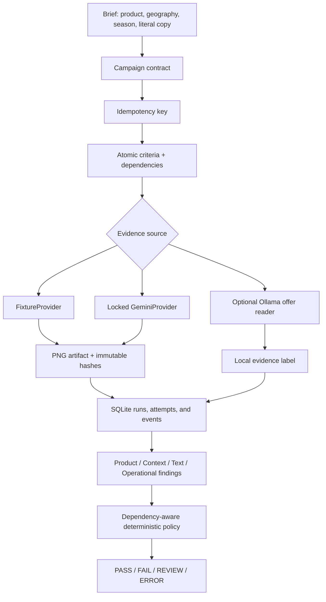
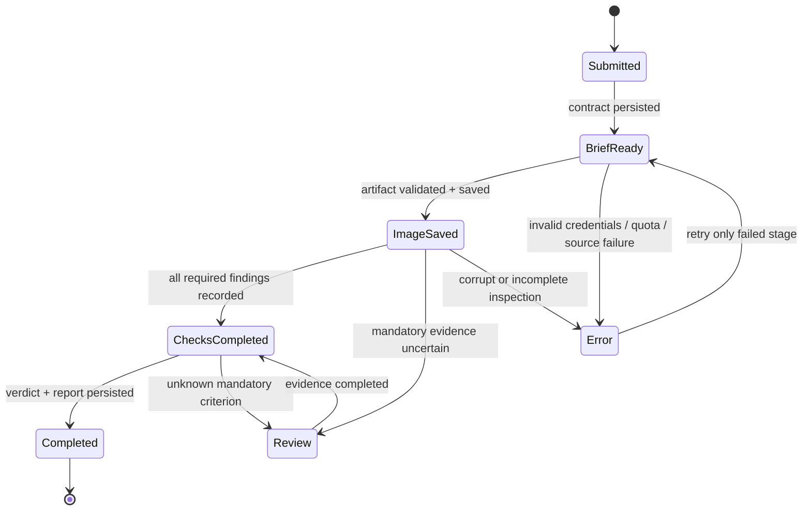
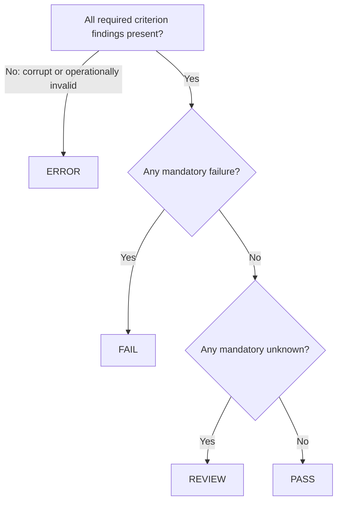
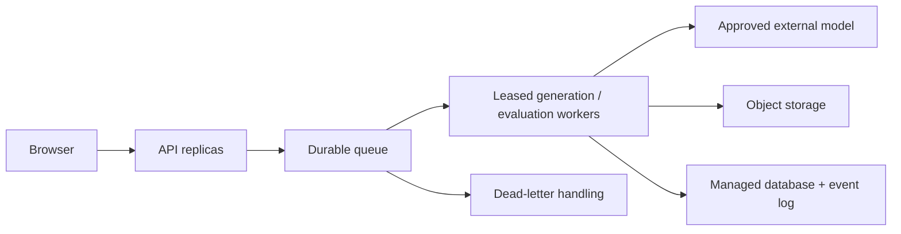

# ProofAd architecture

## Scope boundary

Phase A is a local Next.js evaluation workbench. It proves the campaign contract, evidence schema, dependency policy, human-label surface, persistence model, and recovery behavior with deterministic fixtures. Optional Ollama output is supplementary local evidence only. It does not alter the official verdict.

Gemini provider classes are deliberately locked in this phase. No live request is made until the approved Phase B call budget, model IDs, and credentials are explicitly supplied.

## Current data flow

The campaign contract and the saved report carry the strategy/evidence-source metadata used for that run. Each inspection finding is independently visible; there is no hidden aggregate score that can mask a mandatory failure. The model is an input to the evidence process, not the system’s authority.

## Event state and recovery

State changes are committed as events with run ID, attempt ID, stage, timestamp, status, and artifact references. Artifact persistence precedes its completed checkpoint. This allows the interface to reopen a run after refresh and retain an image when a later check cannot finish.

The local idempotency key prevents duplicate submissions within this application. It cannot prove exactly-once execution by a future remote image provider: a network timeout may occur after the provider received or completed a request. Phase B must therefore classify ambiguous completion as unknown rather than automatically submit another billable request.

## Verdict policy

1. A failed mandatory check produces `FAIL`.
2. Missing or uncertain mandatory evidence produces `REVIEW`.
3. Incomplete, corrupt, or operationally invalid inspection produces `ERROR`.
4. Only an inspection with all mandatory checks passing produces `PASS`.

Dependencies prevent contradictory credit. For example, product attributes cannot pass when product presence failed.

## Proposed Phase B boundary

This is a proposed production design, not a capability demonstrated by the local prototype. A production version needs explicit idempotent consumers, worker leases, retry limits, dead-letter handling, monitoring, and failure-domain analysis. Kubernetes probes and replicas can assist with application availability but do not independently provide durable data, queue, or external-provider availability.
