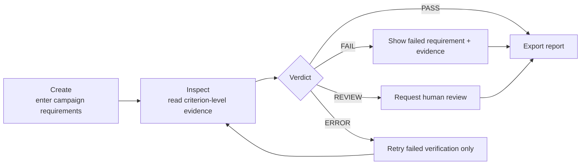

# Design and architecture

## User model

> You describe the campaign. ProofAd generates an image, checks it, and shows what needs attention.

The interface uses labelled controls, explicit stage/state labels, requirement-to-evidence mapping, and retained saved runs. This applies Norman's discoverability, feedback, constraints, recovery, and reflective decision-making principles.

## Phase A flow

`fixture brief → frozen contract + prompt → persisted image record → OCR/visual evidence schema → dependency validation → deterministic verdict → report`

SQLite retains run payloads, stage events, and annotations. Fixture records are idempotent by fixture ID; a presentation run receives a fresh generated ID and is saved independently. An interrupted result is never automatically promoted to approval.

## Verdict policy

- Any mandatory `fail` → `FAIL`.
- Otherwise any mandatory `unknown` → `REVIEW`.
- All mandatory `pass` → `PASS`.
- Any operational `error` → `ERROR`.

When product presence fails, other product attributes are changed to `unknown`; they cannot independently pass. Correct text cannot compensate for a wrong product or offer.

## Evaluation contract and future evidence collection

Both strategies include all user requirements. Baseline is a concise complete request; structured prompt uses TASK, PRODUCT INVARIANTS, CAMPAIGN CONTEXT, EXACT COPY, COMPOSITION, and OUTPUT CONSTRAINTS. The exact compiled prompt and version are retained per run.

Phase B will send the reference and frozen contract to an approved image source, save immutable returned bytes, validate the long edge before display, then run local OCR and one structured visual-evidence call. The evaluator receives reference, output, and frozen contract—but no human labels, desired verdict, or generator rationale. The model selection is intentionally an implementation detail; the reusable contribution is the frozen evaluation contract, independent evidence, dependency policy, and human-calibrated measurement.

## Interaction experience

`/app` is the single primary workspace. It presents one campaign brief form, one clear action, one result panel, and a collapsed saved-run history. The result keeps the campaign requirements, verdict, and criterion-level evidence together. `/demo` redirects to `/app` so there is no duplicate workflow or competing placement.
